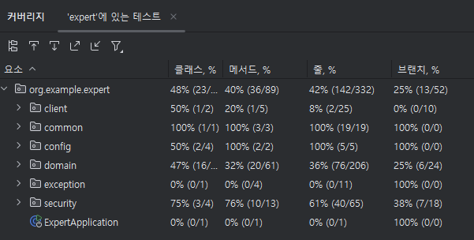

# CH 4 코드 개선 및 테스트 코드 작성 과제

## 📌 학습 키워드
- Fetch Join
- Interceptor
- AOP
- API 로깅
- 테스트 코드
- 테스트 커버리지

 

## 📝 단계별 요구사항
`필수 기능`
- Lv 1. 코드 개선
- Lv 2. N+1 문제
- Lv 3. 테스트코드 연습

`도전 기능`
- Lv 4. API 로깅
- Lv 5. 위 제시된 기능 이외 ‘내’가 정의한 문제와 해결 과정
- Lv 6. 테스트 커버리지

 

## 🔍 새로운 지식
- [@EntityGraph - fetch join을 어노테이션으로 처리하기](https://gajicoding.tistory.com/372)
- [AOP (Aspect-Oriented Programming)](https://gajicoding.tistory.com/373)
- [Interceptor vs AOP(Aspect Oriented Programming)](https://gajicoding.tistory.com/374)
- [테스트 코드 개념](https://gajicoding.tistory.com/369)
- [테스트 코드 개념 2 + Mock 을 이용한 테스트 코드 작성 예제](https://gajicoding.tistory.com/370)
- [테스트 커버리지 - JaCoCo 설정](https://gajicoding.tistory.com/371)
- [IntelliJ 에서 테스트 커버리지 확인하기](https://gajicoding.tistory.com/378)

 

## 💡 설계 & 리팩토링 과정
- [[코드 개선 과제] Interceptor vs AOP, 어떤 방식이 더 적합할까?](https://gajicoding.tistory.com/375)
- [[코드 개선 과제] 공통 예외 로직 추출, 도메인 로직 분리](https://gajicoding.tistory.com/376)
- [[코드 개선 과제] JPQL fetch join -> @EntityGraph](https://gajicoding.tistory.com/377)

 

## 🛡️ 테스트 커버리지
